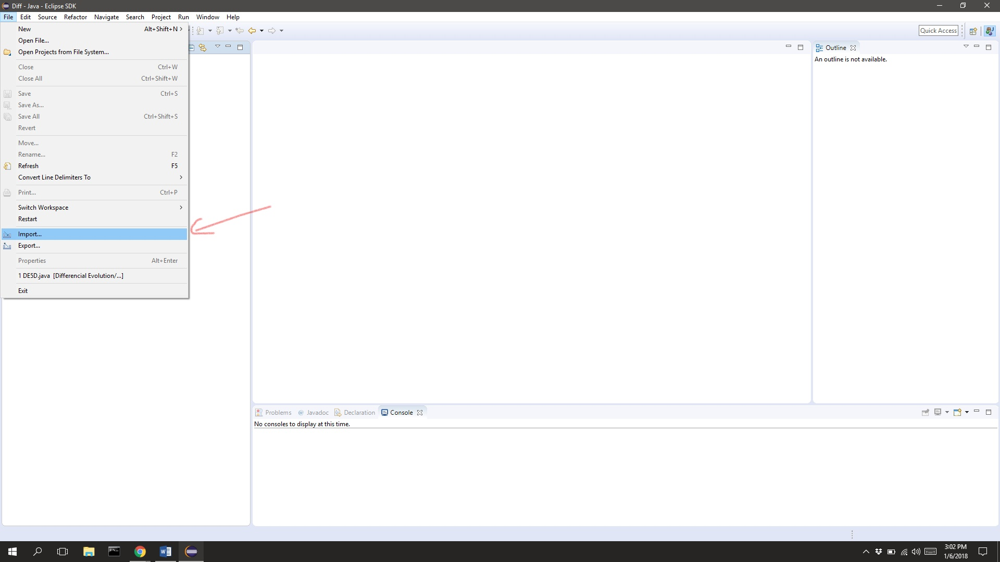
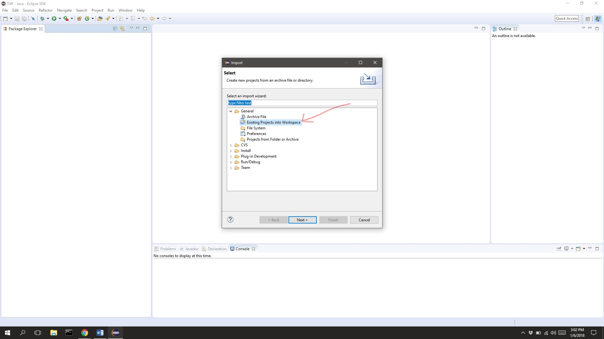
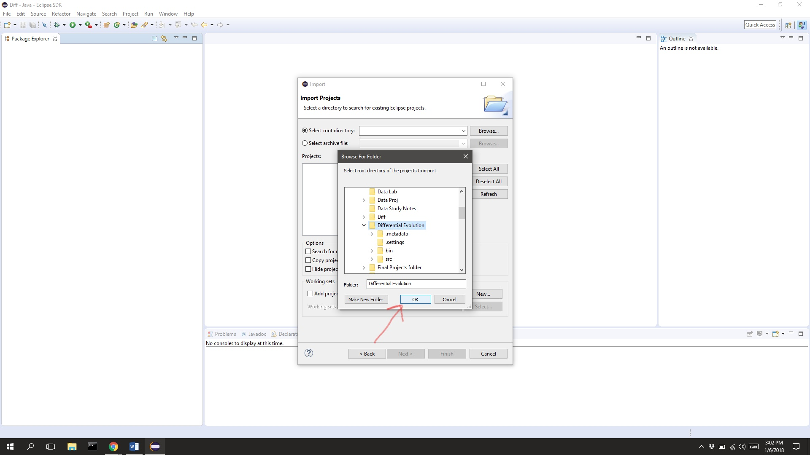
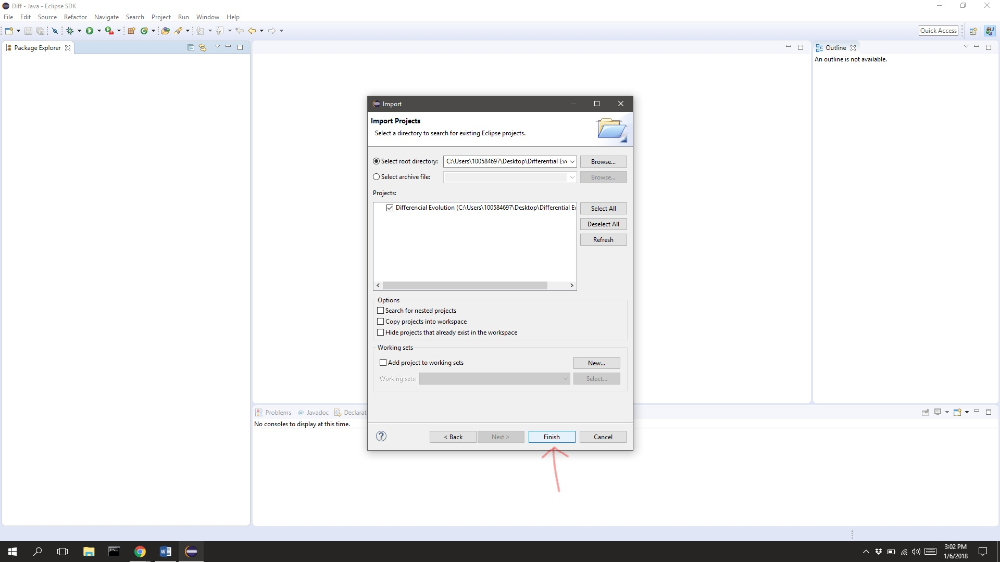
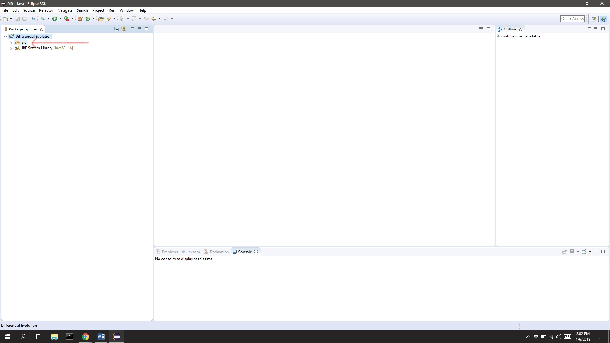
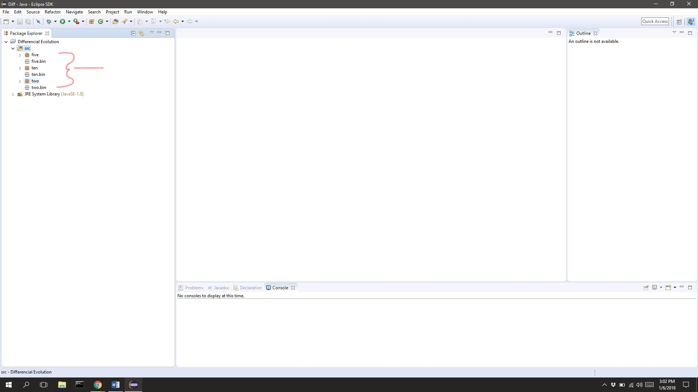
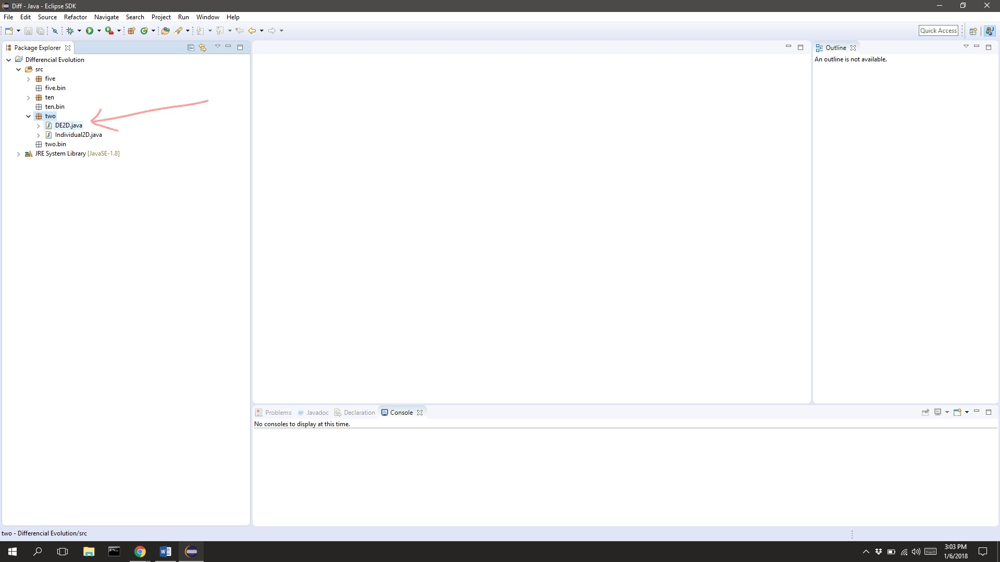
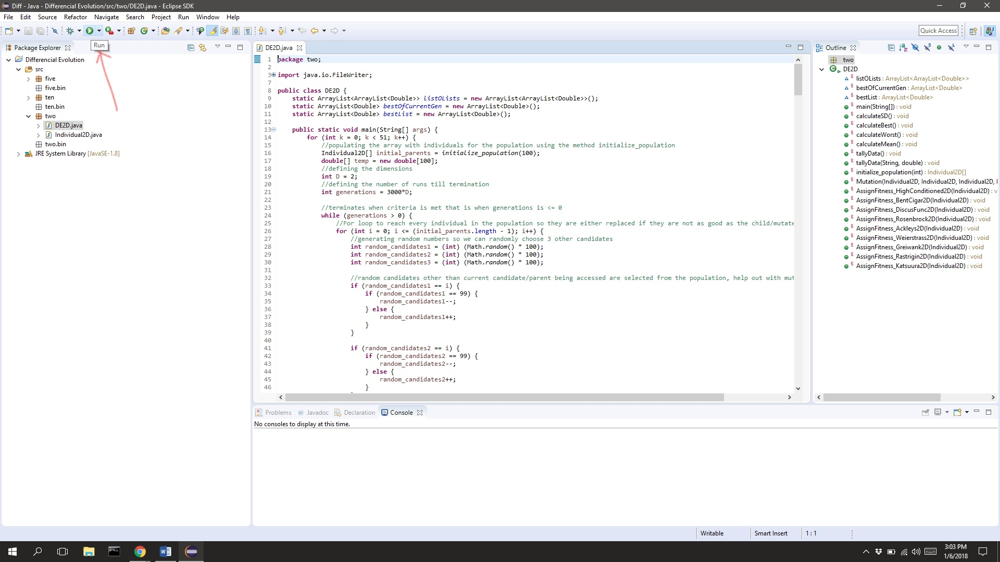
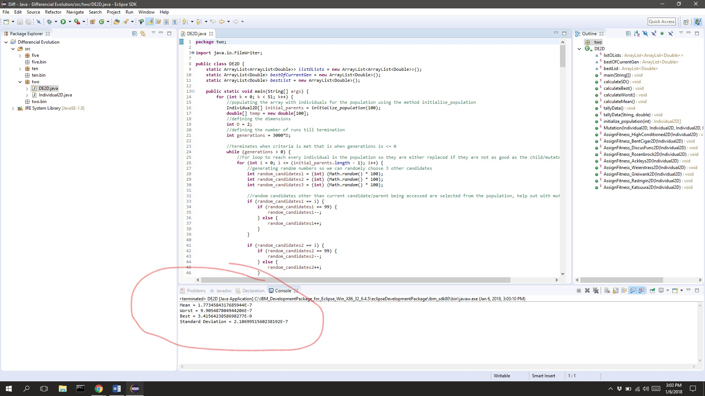

# Differential-Evolution
To run this project you will need **eclipse**

- Download [eclipse](https://www.eclipse.org/downloads/)
- When done downloading both **eclipse** and the **repository** you can now import the project
- Create new project folder
- To import the downloaded project click **file** then select **import**

- Select **General** and in the dropdown select **Existing Projects into Workspace** then **next**

- Specify directory where you downloaded the project then **Finish**

- To run, click **src**

- Under **src** you have options of packages to run. You have **two**, **five** and **ten** these represent the dimensions of the problem you want to solve

- Once you have selected the package, click on the java file **DE2D** if you selected **two**, **DE5D** if you selected **five**, **DE10D** if you selected **ten**

- Select the **run** to run the program

- If you have done everything correctly your results should be displayed as such:

